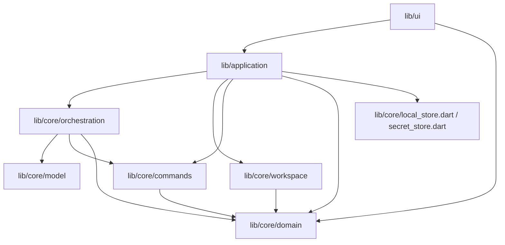

# AI Team Architecture

AI Team is a local-first Flutter desktop app for coordinating model-backed team
work. The product flow is: the UI selects a conversation or management surface,
`AppController` translates user actions into application operations, core
services execute model/workspace/command/patch behavior, and the resulting
`AppState` is persisted as JSON-compatible local state.

The refactor intentionally keeps compatibility facades for existing imports, but
the real boundaries are now the focused Dart libraries below.

## Entry Points

- `lib/main.dart` starts the Flutter desktop app.
- `lib/app.dart` is the app-facing compatibility facade for `AppController`,
  chat streaming helpers, and `AiTeamApp`.
- `lib/core/domain.dart`, `lib/core/model_gateway.dart`, and
  `lib/core/orchestrator.dart` are compatibility facades over focused core
  modules.
- New code should import focused modules directly when it owns that layer. Use
  the facades only for compatibility or high-level app assembly.

## Dependency Direction

Core modules must not import Flutter UI code. UI widgets must not duplicate
workspace path safety, command policy evaluation, or model orchestration rules.

## Module Responsibilities

- `lib/core/domain/`: persisted state, conversation/task/configuration types,
  JSON compatibility, and diff data. This layer has no IO policy.
- `lib/core/model/`: OpenAI-compatible request construction, streaming parsing,
  tool-call parsing, reasoning-effort handling, diagnostics, and gateway
  exceptions.
- `lib/core/orchestration/`: secretary/member assignment planning, visible model
  message execution, tool execution, audit writing, private secretary dispatch,
  and team orchestration. It owns model workflow behavior, not UI state.
- `lib/core/workspace/`: workspace path validation, file listing, file reading,
  and patch proposal creation.
- `lib/core/commands/`: command policy decisions, command execution, and command
  result mapping.
- `lib/application/`: UI-facing state facade. `AppController` remains the public
  facade but delegates conversation visibility, streaming drafts,
  workspace/command work, and persistence flushing to focused components.
- `lib/ui/`: Flutter presentation. Chat controls, message rendering, dialog
  frame widgets, management pages, sidebars, and app shell are separate modules.
  Management UI uses `management_pages.dart` as a barrel over focused config,
  history, audit, settings, chat-status-card, and shared component modules.

## Data Flow

1. UI invokes an `AppController` method for a user action.
2. `AppController` updates application state directly only for UI-facing
   coordination and delegates core behavior to application/core services.
3. Orchestration builds model requests through the model gateway contracts and
   emits progress through `AppState` snapshots plus optional streaming drafts.
4. Workspace and command actions pass through their core services before state is
   committed.
5. State changes go through the persistence queue so async writes can be flushed
   before shutdown.

## Testing Layout

- `test/application/`: `AppController` behavior and extracted application
  components.
- `test/core/domain/`: JSON compatibility, persisted domain behavior, patch
  domain rules, and orchestration/domain integration that still depends on
  persisted state shape.
- `test/core/model/`: model gateway request/response/stream parsing behavior.
- `test/core/orchestration/`: focused orchestration units such as visible model
  message running.
- `test/core/commands/` and `test/core/workspace/`: service-level safety and IO
  rules.
- `test/ui/`: Flutter widget flows, chat panes, dialogs, sidebars, and management
  pages.
- `test/support/`: reusable test doubles shared across test layers. Support code
  must not become an alternate production abstraction.

## Compatibility Boundary

These public imports remain valid:

- `package:ai_team/app.dart`
- `package:ai_team/core/domain.dart`
- `package:ai_team/core/orchestrator.dart`
- `package:ai_team/core/model_gateway.dart`

They exist to preserve caller compatibility while the implementation lives in
focused modules. Do not add new unrelated exports to these facades just to avoid
importing the correct module.
